## Daily Task - The Secure & Private Task Manager

**Daily Task** is a modern, intuitive, and secure task management application designed for individuals who want to stay organized and productive without compromising their privacy.  

✨ Unlike cloud-based solutions, all user data is stored **locally on the device**, ensuring complete privacy and security.  
✨ The app provides a **powerful set of tools** to manage tasks, set priorities, and receive actionable reminders — all from a **simple, clean interface**.  

This repository contains the source code for the **Daily Task** application, built with:  
- ✅ Focus on **seamless user experience**  
- ✅ **Robust feature set**  
- ✅ **Privacy-first architecture**  

---

## 🚀 Core Features

### 📝 Task Management
- Full **CRUD operations** (Create, Read, Update, Delete) for tasks.  
- Mark tasks as **complete** for a sense of accomplishment.  
- **Conditional Completion** → A task can only be marked complete if done **before its due date**.  

---

### 📌 Organization & Prioritization
- **Priority Levels** → Assign tasks as **High, Medium, or Low**.  
- **Due Dates** → Set deadlines to complete tasks on time.  

---

### 🔔 Notifications & Reminders
- **Actionable Notifications** → Timely alerts with actions (Snooze / Mark Complete).  
- **Reminders** → Stay on top of critical deadlines.  

---

### 📂 Data Organization & Search
- **Sorting Options**  
  - By Name (A–Z)  
  - By Priority  
  - By Due Date  
  - By Completion Status  
- **Search Functionality** → Quickly find tasks by name.  

---

### 👤 Personalization & User Profile
- Create and manage a **user profile**.  
- Add a **profile picture** for personalization.  

---

### 🔒 Privacy & Security
- **On-Device Data Storage** → All data stored locally on the device.  
- **No Cloud Storage** → Eliminates risks of remote breaches, ensuring privacy.  

---

## 🎥 Demo Video
Watch the demo on YouTube 👉 [Click Here](https://www.youtube.com/watch?v=Sgd57fWsTBw)

  ## Light Mode Screenshots

  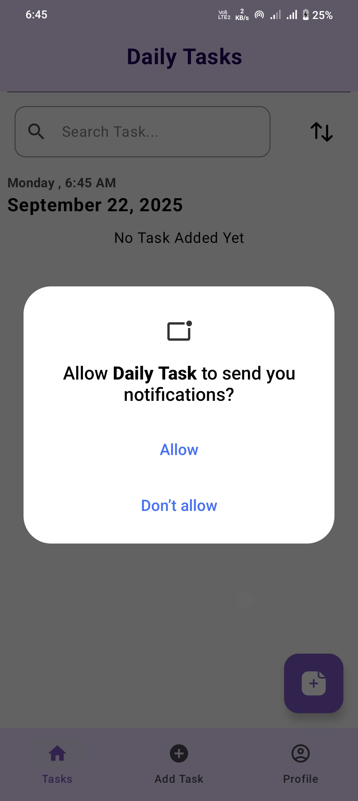&nbsp;&nbsp;&nbsp;&nbsp;
  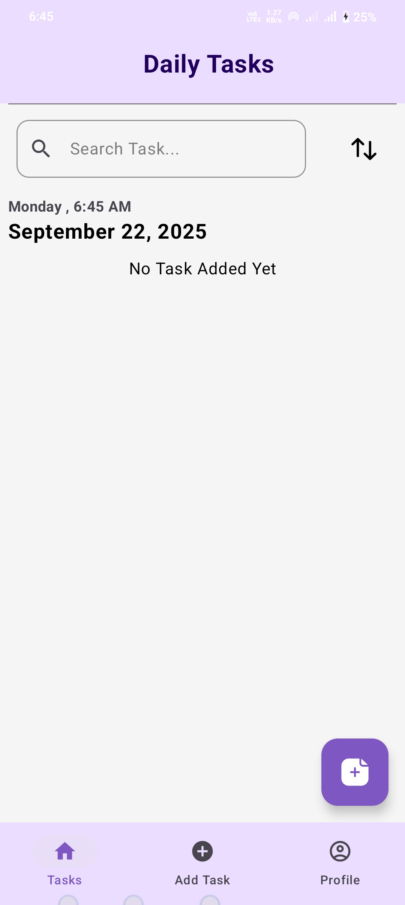&nbsp;&nbsp;&nbsp;&nbsp;
  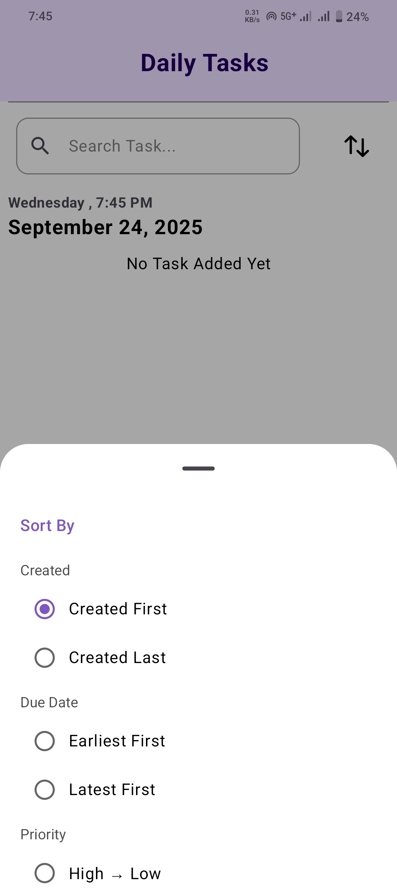&nbsp;&nbsp;&nbsp;&nbsp;

    
  
  

  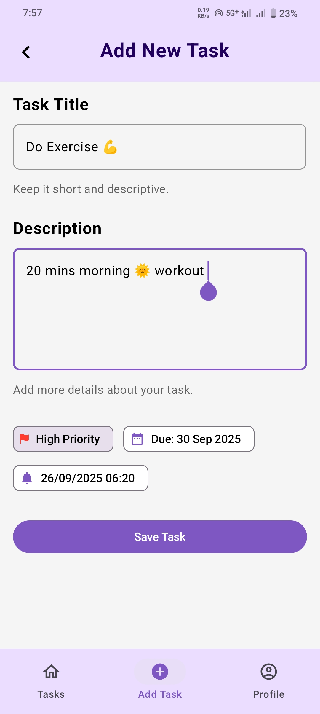&nbsp;&nbsp;&nbsp;&nbsp;
  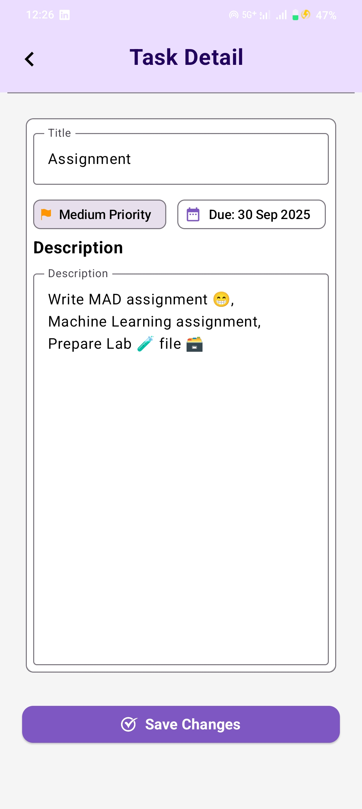&nbsp;&nbsp;&nbsp;&nbsp;
  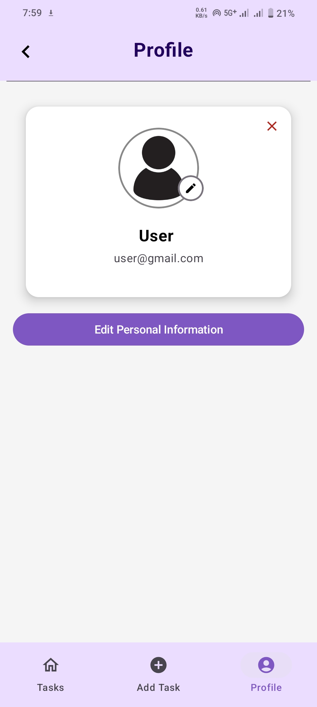&nbsp;&nbsp;&nbsp;&nbsp;

 

## Dark Mode Screenshots

  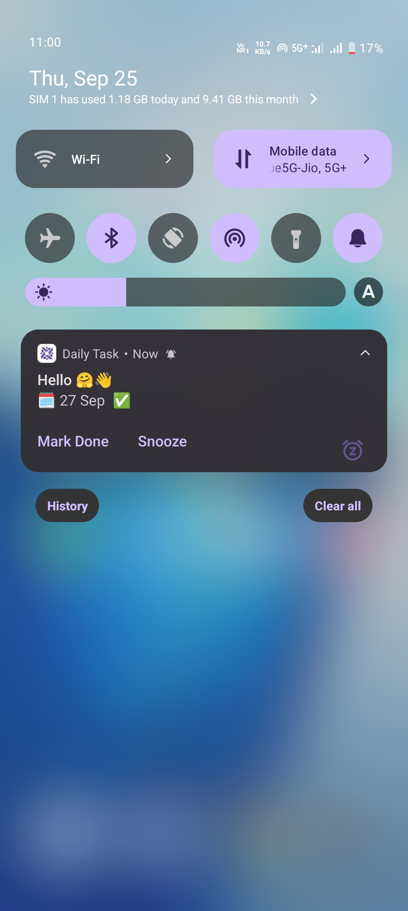&nbsp;&nbsp;&nbsp;&nbsp;
  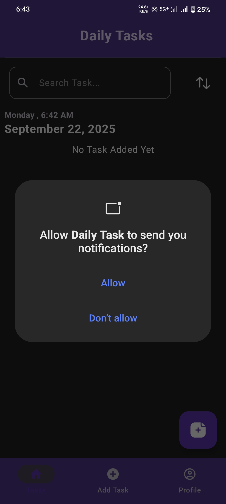&nbsp;&nbsp;&nbsp;&nbsp;
  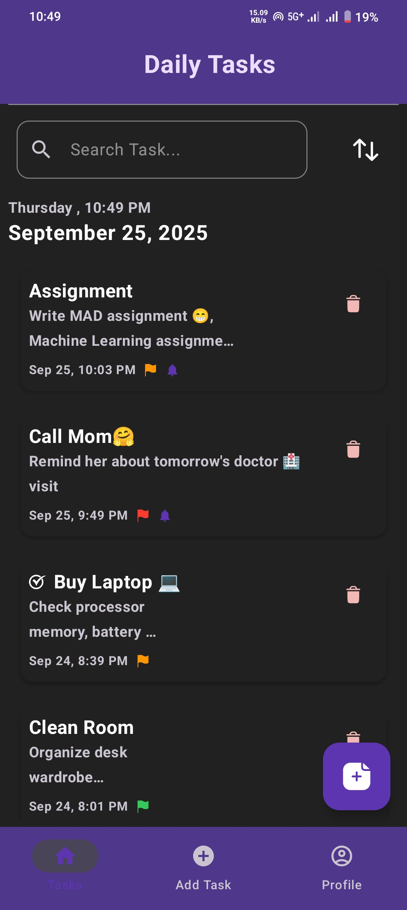&nbsp;&nbsp;&nbsp;&nbsp;

 

  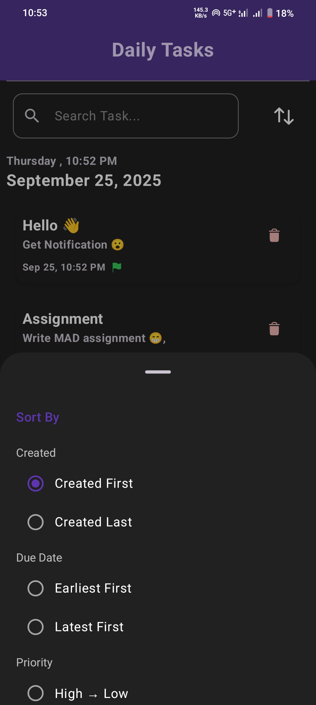&nbsp;&nbsp;&nbsp;&nbsp;
  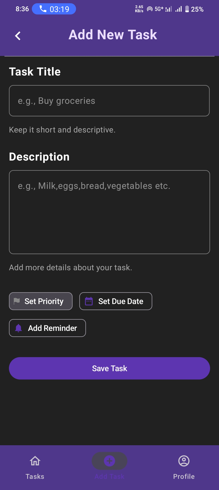&nbsp;&nbsp;&nbsp;&nbsp;
  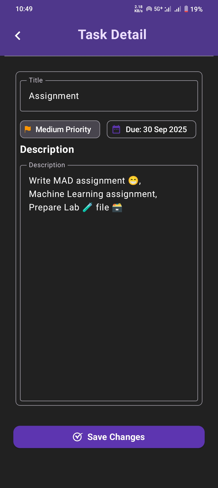&nbsp;&nbsp;&nbsp;&nbsp;
  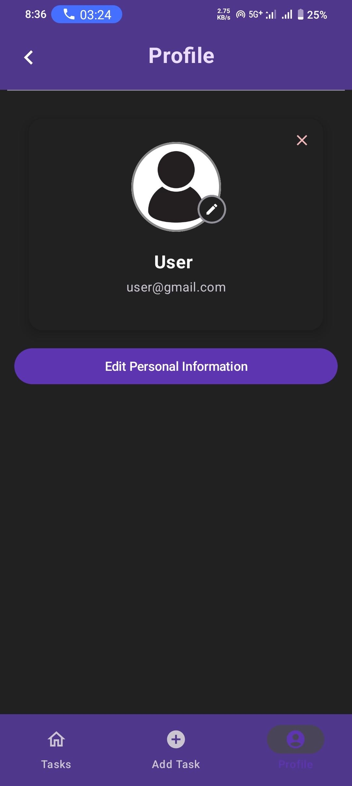&nbsp;&nbsp;&nbsp;&nbsp;

 

## Long Screenshots

  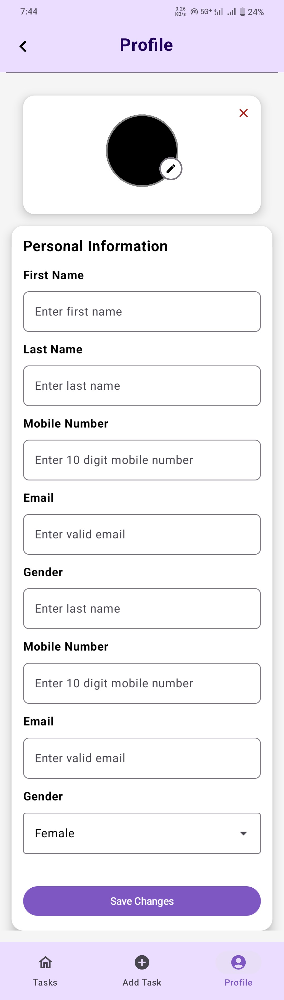&nbsp;&nbsp;&nbsp;&nbsp;
  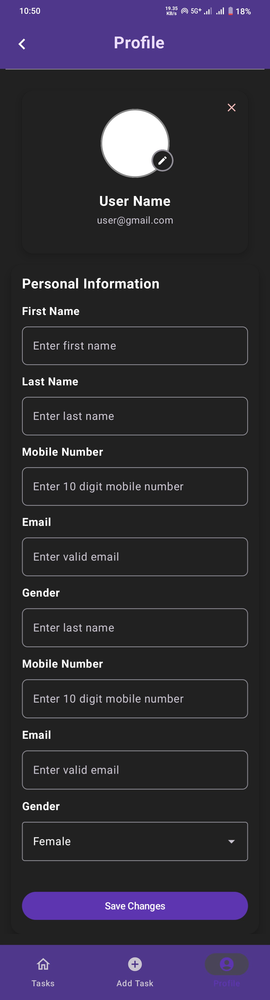&nbsp;&nbsp;&nbsp;&nbsp;

